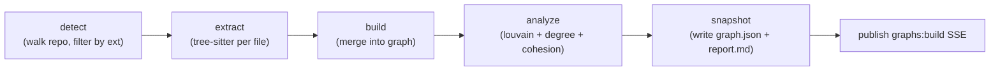
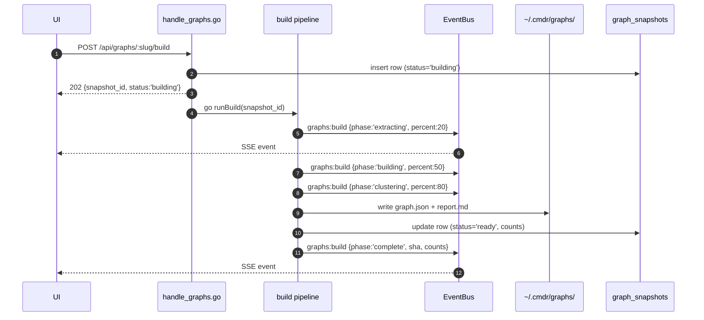

# ADR-0001 — Knowledge Graph

- **Status**: Accepted
- **Date**: 2026-04-29

## Context

Cmdr currently has no way to visualize the structural relationships inside a repo it monitors. Understanding "how does this codebase fit together" requires reading raw files or relying on tribal knowledge. We want a tool that builds a queryable, visualizable graph of code relationships across the repos cmdr already tracks.

Inspiration is drawn from [graphify](https://github.com/safishamsi/graphify): tree-sitter AST extraction, NetworkX-style node/edge graph, Louvain/Leiden community clustering, and a self-contained interactive viewer. The differences are deliberate:

- Graphify is a portable Python skill that produces a static `graph.html` per repo. Cmdr is personal infrastructure that already runs as a daemon with a SvelteKit SPA — we centralize storage and serve a richer multi-facet viewer instead of static HTML.
- Graphify's primary use case is feeding `GRAPH_REPORT.md` to LLMs to save tokens. Our primary use case is **human exploration**; LLM context becomes a future side mode, not the lead feature.
- Graphify mixes AST extraction with paid LLM extraction over docs/PDFs/images. We ship code-only AST in v1 — no API costs, no confidence/ambiguity machinery to reason about, sub-5s rebuilds.

The relevant existing pieces in cmdr we build on:

- **`internal/gitlocal/`** — repo discovery under `~/Code`, commit reading, diffing.
- **`internal/db/`** — SQLite schema; new `graph_snapshots` table joins existing `repos`.
- **`internal/scheduler/`** — robfig/cron with seconds precision; new task hooks in here.
- **`internal/daemon/events.go`** — `EventBus` for SSE; build progress publishes here.
- **`internal/daemon/handle_*.go`** pattern — new file `handle_graphs.go`.
- **`web/src/lib/api.ts`** — frontend API client; new types + helpers added.
- **`web/src/lib/events.ts`** — existing SSE client subscribed to `/api/events`.

## Approach

### Pipeline



Stages are pure functions over plain Go structs. No shared state outside the snapshot directory and the `graph_snapshots` row. Each stage is independently testable.

### Trigger lifecycle



The same goroutine pipeline is used regardless of trigger source (UI button, post-commit hook, scheduler watchdog). Triggers all funnel through `POST /api/graphs/:slug/build`.

### Storage layout

```
~/.cmdr/graphs/
└── <repo-slug>/                        # <basename>-<6char-hash-of-abspath>
    ├── snapshots/
    │   └── <commit-sha>/
    │       ├── graph.json              # canonical artifact
    │       └── report.md               # generated summary
    ├── cache/
    │   └── <content-sha256>.json       # per-file extraction results
    └── .graph_root                     # absolute path of source repo
```

Snapshots are immutable. Rebuilding for a SHA that already has a snapshot is a no-op. The cache is content-hashed, so unchanged files skip re-extraction even across snapshots.

### Data model

**Snapshot file** (`graph.json`):
```json
{
  "schema_version": 1,
  "snapshot": {
    "repo_path": "/Users/mike/Code/cmdr",
    "commit_sha": "abc123…",
    "built_at": "2026-04-29T12:34:56Z",
    "languages": ["go", "ts", "svelte", "sql"]
  },
  "stats": {
    "node_count": 412,
    "edge_count": 891,
    "by_kind":     { "file": 80, "function": 200, "method": 88 },
    "by_relation": { "contains": 280, "calls": 410, "imports": 90 },
    "community_count": 14
  },
  "communities": {
    "0": { "label": "internal/daemon", "node_ids": [], "cohesion": 0.71 }
  },
  "nodes": [
    {
      "id": "internal/daemon/daemon.go::Daemon.registerAPI",
      "label": "registerAPI",
      "kind": "method",
      "language": "go",
      "source_file": "internal/daemon/daemon.go",
      "source_location": "L142-L218",
      "community": 0,
      "degree": 28,
      "attrs": { "receiver": "*Daemon", "exported": false }
    }
  ],
  "edges": [
    {
      "source": "internal/daemon/daemon.go::Daemon.registerAPI",
      "target": "internal/daemon/handle_review.go::reviewHandler",
      "relation": "calls",
      "confidence": "EXTRACTED",
      "attrs": { "call_site": "L168" }
    }
  ]
}
```

**Node kinds** (closed enum): `file`, `module`, `function`, `method`, `class`, `interface`, `type`, `table`, `column`.

**Edge relations** (closed enum): `contains`, `imports`, `calls`, `extends`, `implements`, `uses_type`, `foreign_key`.

**Node ID format**: `<rel-path>::<symbol-fqn>` for symbols, `<rel-path>` for files. Stable across snapshots when name + file are unchanged. File renames produce delete+add in the diff — acceptable v1 tradeoff.

**`confidence`** is reserved on every edge but always `EXTRACTED` in v1. v2 LSP enrichment promotes/adds edges with `INFERRED`.

**v1 stance**: drop call edges that can't be unambiguously resolved within-file or via direct import. Better to undercount than to fill the graph with wrong arrows. LSP enrichment recovers these later.

### DB schema

New table, joins existing `repos`:

```sql
CREATE TABLE graph_snapshots (
  id INTEGER PRIMARY KEY,
  repo_path TEXT NOT NULL,
  repo_slug TEXT NOT NULL,
  commit_sha TEXT NOT NULL,
  built_at DATETIME NOT NULL,
  status TEXT NOT NULL,                  -- 'building' | 'ready' | 'failed'
  node_count INTEGER,
  edge_count INTEGER,
  community_count INTEGER,
  duration_ms INTEGER,
  error TEXT,
  UNIQUE(repo_slug, commit_sha)
);
CREATE INDEX idx_graph_snapshots_repo ON graph_snapshots(repo_slug, built_at DESC);
```

### Triggers and eligibility

- **Eligibility**: only repos in cmdr's existing `repos` table. Unmonitored repos are never built or auto-rebuilt.
- **First build always explicit** — UI button on `/graphs` row.
- **Scheduler watchdog** (new task `graph-watch`): iterates `repos`, gets each `HEAD`, queues a build if HEAD differs from the latest stored SHA *and* at least one prior snapshot exists. Runs every 15 minutes. Repos with zero snapshots are skipped.
- **Optional post-commit git hook** (opt-in per repo): writes a `.git/hooks/post-commit` calling `cmdr knowledge-graph build .` for fastest reaction.
- **Working tree must be clean.** Dirty trees return `409 Conflict` from the build endpoint.

### Analyze passes (v1)

- **Louvain community detection** on the undirected projection of the graph. Communities labeled by most-frequent path component among member nodes. Stored as `community: int` per node + a `communities` block in the snapshot.
- **Degree-based god nodes**: `degree` attribute on each node. Top-N surfaced in `report.md`.
- **Per-community cohesion** (modularity contribution). In report only, not viewer.

Deferred to v2: surprising connections, suggested questions, knowledge gaps, hyperedges.

### API surface

| Method | Path | Returns |
|---|---|---|
| `GET` | `/api/graphs` | `[{repo, snapshot_count, latest_sha, latest_built_at, latest_status, node_count}]` for every monitored repo |
| `GET` | `/api/graphs/:slug/:sha` | `graph.json` contents verbatim |
| `GET` | `/api/graphs/:slug/:sha/report` | `report.md` contents |
| `GET` | `/api/graphs/:slug/diff?from=&to=` | `{added_nodes, removed_nodes, changed_nodes, added_edges, removed_edges}` |
| `POST` | `/api/graphs/:slug/build` | `202 {snapshot_id, status: "building"}` (or `409` if dirty tree, `404` if unmonitored). Progress + completion via SSE. |

### SSE events

Aligned with cmdr's existing `domain:action` naming:

```ts
{ type: "graphs:build", data: { snapshot_id, slug, sha, phase: "started" | "extracting" | "building" | "clustering" | "writing" | "complete" | "failed", percent?: number, error?: string, stats?: { node_count, edge_count, community_count, duration_ms } } }
```

One event type, payload differentiates phase. Frontend subscribes via existing `web/src/lib/events.ts` client.

### Frontend routes

- **`/graphs`** — list of monitored repos. Each row: name, current SHA, snapshot count, last built timestamp, node/edge counts. CTA per row: "Build graph" if zero snapshots, "Open" if any. Live-updates via SSE while a build is in flight (progress bar inline).
- **`/graphs/:slug/:sha`** — fullscreen viewer. No nav chrome (the layout for this route doesn't render the sidebar/header). Esc returns to `/graphs`. Components:
  - **Header bar**: snapshot picker (`<select>` populated from `GET /api/graphs/:slug` listing snapshots, each entry shows `+N / −M nodes` vs prev), facet tabs (Network / Flow / Schema), "Diff vs previous" toggle, "Rebuild" button.
  - **Facet body**: full viewport minus header.
- **`/graphs/:slug/:sha?diff=<other-sha>`** — same viewer, diff highlight mode pre-enabled.

### Visualization facets

| Facet | Library | What it shows |
|---|---|---|
| **Network** | `vis-network` | Force-directed, all nodes + edges, community-colored, sized by degree. Click → node detail panel. Search box. Community toggle in legend. |
| **Flow** | `cytoscape.js` + `dagre` layout | Hierarchical top-down, scoped to a chosen root node and a depth limit. Filtered to `calls` + `imports` edges. |
| **Schema** | hand-rolled SVG | Tables as boxes with column lists, FK lines between columns. Filtered to `kind in {table, column}` and `relation in {contains, foreign_key}`. |

Diff highlight is a Network-facet overlay: ghost-nodes for removals, green for additions, amber for attribute changes. Toggleable.

### What's NOT in v1

For clarity:

- No LSP enrichment — tree-sitter only.
- No markdown/doc/PDF/image lanes — code only.
- No cross-domain (code↔DB) edges. `references_table` deferred.
- No `INFERRED` or `AMBIGUOUS` edges — drop ambiguous calls instead.
- No hyperedges, no surprising-connections analysis, no LLM-suggested questions.
- No `/knowledge-graph` skill. Revisit after the UI shapes itself in real use.
- No standalone HTML export. Defer to v2 if sharing-with-non-cmdr-users becomes a real need.
- No live/dirty-tree snapshots. Build requires clean tree.
- No incremental graph merge — always full rebuild from cached extraction.

## Architectural Implications

**New top-level package** `internal/graph/` — modeled on cmdr's existing `internal/<domain>/` pattern (gitlocal, summarizer, agent). Subpackages per stage where they grow: `extract/`, `build.go`, `analyze.go`, `snapshot.go`, `store.go`.

**Extractor parser choice**: per-language. Phase 1's Go extractor uses Go's stdlib `go/parser` + `go/ast` — most accurate for Go and avoids introducing CGO into the currently pure-Go codebase. Phase 6 introduces tree-sitter (`github.com/smacker/go-tree-sitter` plus per-language grammars) for TS, Svelte, Vue, Python, SQL where stdlib parsers don't exist or aren't sufficient. The extractor interface is language-agnostic; each language picks its parser. CGO impact on `make build` is contained to Phase 6.

**Frontend dependencies**: `vis-network`, `cytoscape`, `cytoscape-dagre`. ER diagram is hand-rolled SVG, no dep. All ESM-friendly, no Vite config changes expected.

**SSE pattern reuse**: `EventBus.Publish(Event{Type: "graphs:build", Data: …})` from inside the build goroutine. No new infrastructure.

**Scheduler hook**: `graph-watch` task registered alongside existing tasks in `internal/scheduler/scheduler.go`. Same dependency-closure pattern (`func(*sql.DB) func() error`).

**Database migration**: schema migration runs on startup like existing migrations. New `graph_snapshots` table; no changes to existing tables.

**Filesystem**: `~/.cmdr/graphs/` is new under the existing `~/.cmdr/` root. Same write/permissions pattern as `~/.cmdr/cmdr.db`.

**Performance budget**: full rebuild on cmdr-sized repos (~150 source files) targets <5s end-to-end. Bottleneck is per-file parsing; cache cuts repeats to milliseconds. If this stretches past ~10s on real repos, reach for incremental merge as an optimization, not a v1 invariant.

**Graph size ceiling**: vis-network slows past ~5k nodes. Past that, the Network facet should fall back to a community-aggregated view (each community as one node, expand on click). Defer until we hit a graph that big.

**No backwards-compat constraints**: this is a new feature; nothing depends on it. Schema can evolve via `schema_version` bumps in the snapshot file. Old snapshots can either be re-built or rendered by a fallback codepath gated on version.

## Implementation Plan

Each phase is independently demoable. Stop and reassess between phases — early phases will surface assumptions worth checking before downstream work commits.

### Phase 1 — Backend foundation (Go-only extractor, single repo)

1. Add `internal/graph/` package skeleton: `extract/extract_go.go`, `build.go`, `analyze.go`, `snapshot.go`, `store.go`, `slug.go`.
2. Implement `extract_go.go` using Go's stdlib `go/parser` + `go/ast`: walk the AST, emit `Node` + `Edge` for files, functions, methods, types, calls (drop ambiguous), imports, type uses. (Tree-sitter is deferred to Phase 6 where multi-language support actually needs it.)
3. Implement `build.go`: merge per-file extractions into a single graph; deduplicate by ID.
4. Implement `analyze.go`: Louvain (small in-tree implementation), degree, cohesion. Annotate nodes with `community`, `degree`. Build `communities` block.
5. Implement `snapshot.go`: serialize to `graph.json`, generate `report.md`.
6. Implement `store.go`: write to `~/.cmdr/graphs/<slug>/snapshots/<sha>/`, manage `cache/` directory.
7. Implement `slug.go`: `<basename>-<6char-hash-of-abspath>` derivation.
8. Add DB migration in `internal/db/`: new `graph_snapshots` table.
9. Unit tests under `internal/graph/`: fixture-based extraction tests on a small Go module; round-trip snapshot read/write.

**Deliverable**: `go test ./internal/graph/...` passes; running the pipeline manually against cmdr itself produces a `graph.json` with reasonable counts.

### Phase 2 — API + SSE wiring

1. Add `internal/daemon/handle_graphs.go` with `GET /api/graphs`, `GET /api/graphs/:slug/:sha`, `GET /api/graphs/:slug/:sha/report`, `POST /api/graphs/:slug/build`. Defer the diff endpoint to phase 7.
2. Register routes in `internal/daemon/daemon.go::registerAPI()`.
3. Build endpoint launches a goroutine that runs the pipeline, publishes `graphs:build` events at each phase, writes snapshot row to DB, updates row to `ready` on success or `failed` on error.
4. `GET /api/graphs` does a `LEFT JOIN repos … LEFT JOIN graph_snapshots …` so every monitored repo has a row even with zero snapshots.
5. Add types + fetch helpers in `web/src/lib/api.ts`.

**Deliverable**: `POST /api/graphs/:slug/build` against a monitored repo produces a snapshot on disk; subsequent `GET` returns the JSON; SSE clients receive progress events.

### Phase 3 — Frontend list view

1. New route `web/src/routes/graphs/+page.svelte`.
2. Fetch + render monitored repos with metadata. "Build graph" CTA on rows with zero snapshots; "Open" link on rows with ≥1 (links to `/graphs/:slug/<latest-sha>`).
3. Subscribe to `graphs:build` SSE events; show inline progress bar + phase label on the building row.
4. Add "Graphs" entry to the sidebar in `web/src/routes/+layout.svelte`.

**Deliverable**: clicking "Build graph" on the cmdr row in `/graphs` triggers a build, shows live progress, lights up the "Open" link when done.

### Phase 4 — Viewer with Network facet

1. New route `web/src/routes/graphs/[slug]/[sha]/+page.svelte`. Layout opts out of nav chrome (use a dedicated layout file or conditional rendering on the root layout).
2. Fetch `graph.json` for the snapshot. Centralize in a Svelte store so all facets subscribe.
3. Add `vis-network` dep. Implement `web/src/lib/components/graphs/NetworkFacet.svelte`: force-directed layout, community coloring, degree-sized nodes, search, click → detail panel.
4. Header bar component: snapshot picker, facet tabs (only Network active in this phase), Rebuild button, Esc → `/graphs`.
5. Snapshot picker fetches from a per-repo snapshot list endpoint (extract from `GET /api/graphs` response or add a dedicated `GET /api/graphs/:slug/snapshots`).

**Deliverable**: clicking "Open" on a built repo shows the Network facet fullscreen; can switch between snapshots; rebuild works inline.

### Phase 5 — Flow and Schema facets

1. Add `cytoscape` + `cytoscape-dagre` deps.
2. Implement `FlowFacet.svelte`: filters edges to `calls`+`imports`, lets user pick a root node, renders dagre top-down, depth limit slider.
3. Implement `SchemaFacet.svelte`: filters to `kind in {table, column}`, renders tables as SVG boxes with column lists, FK lines between columns.
4. Wire facet tabs in the viewer header.

**Deliverable**: full three-facet viewer works on a graph that includes Go, TS, and SQL.

### Phase 6 — Multi-language extractors

1. Add tree-sitter grammar deps for TS, Svelte, Vue, Python, SQL via `github.com/smacker/go-tree-sitter`. Verify `make build` still works with CGO.
2. Implement extractors: `extract_ts.go`, `extract_svelte.go`, `extract_vue.go`, `extract_python.go`, `extract_sql.go`. Each emits the same `{nodes, edges}` shape; build pipeline is unchanged.
3. Update `detect.go` (or in-package equivalent) to dispatch by file extension.
4. SQL extractor produces `table` and `column` nodes plus `contains` and `foreign_key` edges — feeds the Schema facet.
5. Per-language fixture tests.

**Deliverable**: building cmdr produces a graph that includes the SvelteKit frontend + SQL migrations; building a JS/TS-heavy repo (e.g. the user's primary frontend project) produces a sensible graph.

### Phase 7 — Diff endpoint and diff highlight mode

1. Add `GET /api/graphs/:slug/diff?from=&to=` handler. Loads two graph.jsons, computes set differences, returns delta.
2. Frontend: snapshot picker entries show `+N / −M nodes` hints (computed lazily via the diff endpoint, cached client-side).
3. Diff highlight mode in Network facet: toggle in viewer header reads `?diff=<other-sha>` from URL; ghost-nodes for removals, green/amber/red overlays.

**Deliverable**: toggle "Diff vs previous" on any snapshot to see what changed.

### Phase 8 — Scheduler watchdog and post-commit hook

1. Add scheduler task `graph-watch` in `internal/scheduler/scheduler.go`. Iterates `repos`, finds repos with ≥1 snapshot, queues build if HEAD ≠ latest stored SHA. Runs every 15 minutes.
2. Add CLI command `cmdr knowledge-graph hook install/uninstall/status` in `cmd/cmdr/`. Writes / removes a small `.git/hooks/post-commit` that calls `curl -X POST http://localhost:7369/api/graphs/<slug>/build` (or the equivalent `cmdr` subcommand).
3. Document hook installation in CLAUDE.md gotchas section.

**Deliverable**: commit on a graphed repo and watch a new snapshot appear automatically.

---

## Future work (not in v1)

- LSP enrichment pass that promotes dropped call edges from "missing" to `EXTRACTED`.
- Doc/markdown extraction lane producing `INFERRED` semantic edges.
- LLM "explain this subgraph" mode: lasso-select nodes in the viewer → POST node IDs to a new endpoint → server returns subgraph excerpt → LLM answers a question with that as context.
- `/knowledge-graph` skill — design after the UI's friction points are known.
- Standalone HTML export for sharing graphs with users who don't run cmdr.
- Cross-domain (code↔DB) edges via SQL pattern matching in code.
- Live/dirty-tree snapshots if the "must commit first" friction proves real.
- Snapshot retention policy if the picker UI gets unwieldy.
- Community-aggregated fallback view for graphs > 5k nodes.
